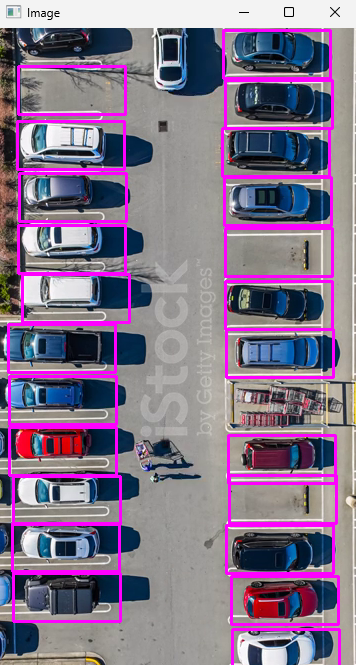
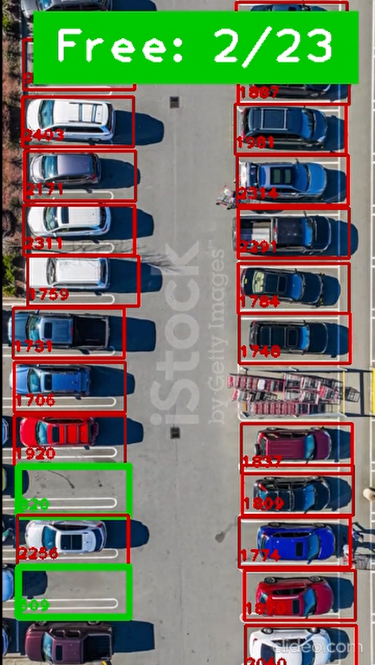

# Parking Space Counter and Ticket Generation System

## Overview

This project is a **Parking Space Counter and Ticket Generation System** that utilizes **OpenCV**, **Flask**, and **MERN Stack** to detect parking spaces, count available slots, and generate parking tickets using Optical Character Recognition (OCR).

---

## Project Components

### 1. **Parking Space Picker (`parkingSpacePicker.py`)**

The script enables the admin to manually mark parking spaces on an image as a one-time process. It:

- Loads an image of a parking lot.
- Enables admin to mark parking spaces by clicking on them.
- Allows removal of parking spaces using a right-click.
- Saves the marked spaces using Python's `pickle` module.

#### **Key Features**

- Uses OpenCV to display and modify an image.
- Stores parking space coordinates in a file (`CarParkPos`).
- Click-based addition and removal of parking spaces.

---

### 2. **Main Parking Detection System (`main.py`)**

This script detects occupied and free parking spaces in a video stream. It:

- Loads a parking video.
- Reads predefined parking space positions from `CarParkPos`.
- Applies image preprocessing and thresholding to detect parked vehicles.
- Uses Flask to provide a web interface for real-time video streaming.

#### **Key Features**

- **Video Processing:** Uses OpenCV to process frames in real time.
- **Parking Detection:** Analyzes parking spaces and marks them as occupied or free.
- **Web Server:** Flask-based web app streams the parking video.
- **Adjustable Parameters:** Users can fine-tune detection thresholds with trackbars.

---

### 3. **Ticket Generation System (`NumberToText.js`)**

A **React.js** component for generating parking tickets. It:

- Uses **Tesseract.js** (OCR) to extract vehicle number plates from images.
- Sends recognized number plate data to a backend server.
- Computes parking duration and charges.
- Displays a parking ticket with entry/exit time and total amount.

#### **Key Features**

- **OCR Integration:** Extracts number plates from images.
- **Backend Communication:** Sends extracted data to a server.
- **Billing System:** Computes parking charges based on duration.
- **User Interface:** Displays a formatted ticket with all necessary details.

---

## **How to Run the Project**

### **1. Setup Python Environment**

Install required dependencies:

```sh
pip install -r requirements.txt
```

Run the parking space picker to mark spaces:

```sh
python parkingSpacePicker.py
```

Run the main parking detection system:

```sh
python main.py
```

### **2. Setup React Frontend**

Navigate to the Ticket Generator project folder and install dependencies:

```sh
npm install
```

Start the backend server (remember to edit the index.js file to point to your server):

```sh
node index.js
```

Start the React app:

```sh
npm start
```

---

## **Technology Stack**

- Python
- OpenCV
- Flask
- Pickle
- React.js
- Tesseract.js (OCR)
- Bootstrap (for styling)
- Node.js / Express.js

---

## **Output**



[](output/aps_output.mp4)
